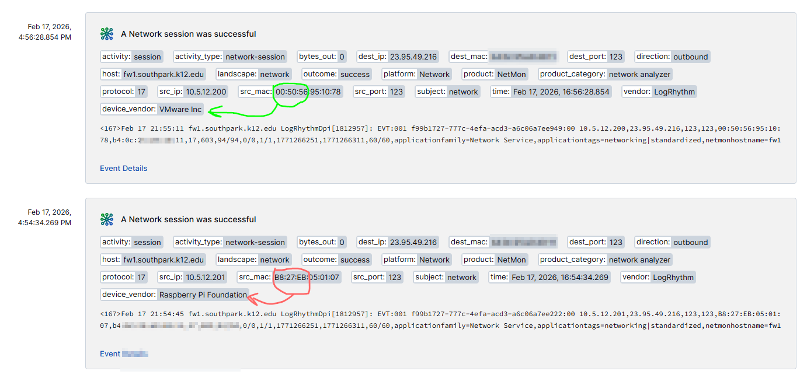

# Log Stream Enrichment - Source MAC Address to OUI Vendor

Description: Here is an old SIEM technique; enrich your logs with the Vendor name from the organizationally unique identifier (OUI). 
Version: 1.0 
Author: Mark Ulmer US Service Consultant - February 2026 

## Setup Service

1. **Add Context Table**
   - Navigate to Context Management then select "New Context Table"
   - Select "Add Custom"
   - Context Table Name: OUI_Lookup
   - Context Table Type: Other
   - Next
   - Add Attributes: Key and Value
   - Create
   
2. **Upload a Suspicious list from CSV**
   - Navigate to OUI_Lookup
   - Download this file [OUI_Lookup_Suspicious.csv](../OUI_Vendor_Enrichment/OUI_Lookup_Suspicious.csv)
   - TIP: You might want to add your most suspicious OUI pefixes here. This is only an example list.
   - Upload CSV
   - Append Data
   
3. **Upload a Common list from CSV**
   - Download this file [OUI_Lookup_Common.csv](../OUI_Vendor_Enrichment/OUI_Lookup_Common.csv)
   - TIP: You might want to add your most popular and authorized OUI pefixes here. This is not a complete list.
   - Upload CSV
   - Append Data
   
5. **Log Stream | Enrichments **
   - Navigate to Log Stream, then select Enrichments
   - Download this Enrichment config file [Enrichment-Source_MAC_Address_to_OUI_Vendor.conf](../OUI_Vendor_Enrichment/Enrichment-Source_MAC_Address_to_OUI_Vendor.conf)
   - Import and select file

## Here is what an Enrichment looks like:

   
   
## Reference Materials:
[YouTube video - Using MAC Address To Determine Manufacturer](https://youtu.be/gCXLO5cCTzM?si=bfloCcdNSrLy6EPQ) 
[Wikipedia - What is Organizationally unique identifier](https://en.wikipedia.org/wiki/Organizationally_unique_identifier) 
[Source Database of All MAC OUI](https://maclookup.app/downloads/csv-database) 

